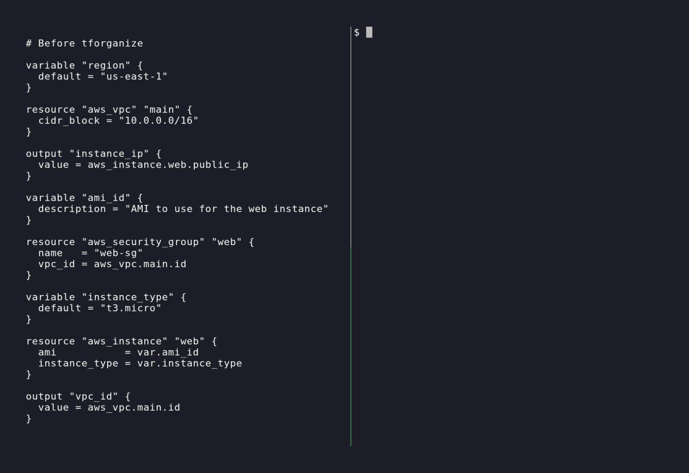

# tforganize

> Opinionated Terraform file organizer — keep modules, variables, resources, and meta-arguments in a predictable order.

`tforganize` is a CLI that rewrites `.tf` files so they match a consistent layout. It sorts blocks, enforces Terraform's canonical meta-argument order, optionally splits output by block type, and protects custom headers/comments when you want to keep them.



## Features at a glance

- **Deterministic sorting** – resources, modules, variables, outputs, checks, imports, etc. are emitted in a stable order.
- **Terraform-aware meta args** – `count`, `for_each`, `providers`, `moved`, `removed`, `check`, and friends are placed exactly where Terraform expects them.
- **Group-by-type output** – `tforganize sort -g` rewrites files into logical targets (`variables.tf`, `outputs.tf`, `checks.tf`, `imports.tf`, `main.tf`, …).
- **Header/comment control** – strip comments entirely, preserve them, or keep/apply a custom header banner.
- **Stdin support** – pipe HCL content via stdin (`cat main.tf | tforganize sort -`) for easy integration with other tools.
- **Inline or out-of-place** – update files in place (`--inline`) or emit to an output directory for review/CI.
- **Configurable** – every flag has a YAML counterpart so you can save defaults in `.tforganize.yaml` or supply `--config`.
- **CI friendly** – published as a Go binary and as `ghcr.io/dthagard/tforganize/tforganize:latest` for Docker/GitLab/GitHub runners.

## Installation

### Homebrew

```bash
brew tap dthagard/tap
brew install tforganize
```

### Go

> Requires Go **1.23+**

```bash
go install github.com/dthagard/tforganize@latest
```

### Docker

```bash
docker run --rm -v "$(pwd)":/tforganize -w /tforganize ghcr.io/dthagard/tforganize/tforganize:latest sort -i .
```

## Quick start

Sort everything in the current directory in-place:

```bash
tforganize sort -i .
```

Split blocks by type (creates `variables.tf`, `outputs.tf`, `checks.tf`, `imports.tf`, etc.):

```bash
tforganize sort --group-by-type --output-dir ./sorted
```

Sort all nested directories recursively:

```bash
tforganize sort --recursive --inline .
```

Sort from stdin:

```bash
cat main.tf | tforganize sort -
```

Preview changes without writing anything:

```bash
tforganize sort --diff .
```

Check for drift in CI (exits non-zero and shows what changed):

```bash
tforganize sort --diff --check .
```

Keep a copyright header while stripping other comments:

```bash
tforganize sort \
  --inline \
  --has-header \
  --header-pattern "$(cat header.txt)" \
  --keep-header \
  --remove-comments
```

## CLI reference

```text
Usage: tforganize sort [file | folder | -] [flags]

Flags:
  -c, --check                   exit non-zero if any file would change (dry-run mode)
      --config string           YAML config path (default $HOME/.tforganize.yaml)
  -d, --debug                   enable verbose logging
      --diff                    show a unified diff of changes instead of writing files
  -x, --exclude stringArray     glob pattern to exclude from sorting (repeatable; supports **)
  -g, --group-by-type           write each block type to its default file (see table below)
  -e, --has-header              treat files as having a header matched by --header-pattern
  -p, --header-pattern string   regex or multi-line string that matches the header block
  -i, --inline                  rewrite files in place (otherwise write to --output-dir)
  -k, --keep-header             preserve the matched header in the output (requires --has-header and pattern)
  -o, --output-dir string       directory for sorted files (required unless --inline)
  -R, --recursive               sort all nested directories (each directory independently)
  -r, --remove-comments         drop all comments except headers kept via --keep-header
```

`--diff` and `--check` can be combined: `--diff --check` prints the unified diff **and** exits non-zero if any file would change.

### Exit codes

| Code | Meaning |
|------|---------|
| `0`  | Success (or no changes in `--check` mode) |
| `1`  | Runtime error (invalid flags, parse failure, I/O error, etc.) |
| `2`  | `--check` detected files that would change |

### Environment variables

All flags can also be set via environment variables prefixed with `TFORGANIZE_`. Dashes become underscores:

```bash
TFORGANIZE_INLINE=true tforganize sort .
TFORGANIZE_GROUP_BY_TYPE=true tforganize sort --output-dir ./sorted .
TFORGANIZE_EXCLUDE='.terraform/**' tforganize sort .
```

## Exclude files

You can exclude specific files or directories from sorting using glob patterns. The pattern is matched against the file path relative to the target directory.

-   Supports standard wildcards (`*`, `?`)
-   Supports recursive matching (`**`)

```bash
# Skip .terraform directory and generated files
tforganize sort . --exclude '.terraform/**' --exclude '*.generated.tf'
```

## Group-by-type target files

When `--group-by-type` (or `group-by-type: true` in config) is enabled, blocks are emitted to the following defaults:

| Block type  | File name        |
|-------------|------------------|
| `data`      | `data.tf`        |
| `locals`    | `locals.tf`      |
| `output`    | `outputs.tf`     |
| `terraform` | `versions.tf`    |
| `variable`  | `variables.tf`   |
| `check`     | `checks.tf`      |
| `import`    | `imports.tf`     |
| `moved`     | `main.tf`        |
| `removed`   | `main.tf`        |
| everything else | `main.tf`   |

You can feed multiple files and directories; `tforganize` builds the combined AST, sorts it, and then writes these grouped files to the chosen output.

## Configuration file

All flags can be set via YAML (default `$HOME/.tforganize.yaml` or pass `--config`). Example:

```yaml
# ~/.tforganize.yaml
group-by-type: true
inline: true
remove-comments: false
has-header: true
keep-header: true
header-pattern: |
  /**
   * Company Confidential
   */
exclude:
  - .terraform/**
  - terraform.tfstate.d/**
  - "*.generated.tf"
```

Key fields:

| Key              | Description                                  |
|------------------|----------------------------------------------|
| `check`          | Same as `--check`                            |
| `diff`           | Same as `--diff`                             |
| `exclude`        | List of glob patterns to exclude             |
| `group-by-type`  | Same as `--group-by-type`                    |
| `has-header`     | Indicates a header block exists              |
| `header-pattern` | Multi-line string or regex used to match header |
| `inline`         | Same as `--inline`                           |
| `keep-header`    | Re-emit the matched header (requires the two options above) |
| `output-dir`     | Same as `--output-dir`                       |
| `recursive`      | Same as `--recursive`                        |
| `remove-comments`| Same as `--remove-comments`                  |

`tforganize` refuses to run with `keep-header: true` unless `has-header` is true **and** `header-pattern` is non-empty — the same validation applies to CLI flags.

## Automation examples

### pre-commit

Add `tforganize` as a [pre-commit](https://pre-commit.com) hook so it runs automatically before every commit.

#### Script hook (requires `tforganize` on PATH)

```yaml
# .pre-commit-config.yaml
repos:
  - repo: https://github.com/dthagard/tforganize
    rev: v0.0.0  # replace with the desired tag
    hooks:
      - id: tforganize
```

This runs `scripts/pre-commit-tforganize.sh`, which calls `tforganize sort --inline` on the staged `.tf` files. If `tforganize` is not installed you will see a clear error with installation instructions.

#### Docker hook (no Go installation required)

```yaml
# .pre-commit-config.yaml
repos:
  - repo: https://github.com/dthagard/tforganize
    rev: v0.0.0  # replace with the desired tag
    hooks:
      - id: tforganize-docker
```

This pulls `ghcr.io/dthagard/tforganize/tforganize:latest` and runs the sort inside the container. Ideal for teams where not everyone has Go installed.

### GitHub Actions

```yaml
name: Terraform hygiene

on:
  pull_request:

jobs:
  tforganize:
    runs-on: ubuntu-latest
    container: ghcr.io/dthagard/tforganize/tforganize:latest
    steps:
      - uses: actions/checkout@v4
      - run: tforganize sort --diff --check "$TF_ROOT"
    env:
      TF_ROOT: infrastructure
```

### GitLab CI

```yaml
stages: [lint]

terraform:lint:
  stage: lint
  image:
    name: ghcr.io/dthagard/tforganize/tforganize:latest
    entrypoint: [""]
  script:
    - tforganize sort --diff --check "$TF_ROOT"
  rules:
    - if: $CI_PIPELINE_SOURCE == "merge_request_event"
  variables:
    TF_ROOT: infrastructure
```

### CircleCI

```yaml
version: 2.1

executors:
  tforganize:
    docker:
      - image: ghcr.io/dthagard/tforganize/tforganize:latest

jobs:
  lint:
    executor: tforganize
    steps:
      - checkout
      - run: tforganize sort --diff --check "$TF_ROOT"

workflows:
  version: 2
  terraform:
    jobs:
      - lint
```

### Azure Pipelines

```yaml
trigger:
  branches:
    include: [ main ]

pool:
  vmImage: ubuntu-latest

container: ghcr.io/dthagard/tforganize/tforganize:latest

steps:
  - checkout: self
  - script: tforganize sort --diff --check $(TF_ROOT)
    displayName: Run tforganize
```

### Makefile loop

```make
TF_DIRS := $(shell find . -type d -not -path '*/.terraform/*')

tforganize-all:
	@for dir in $(TF_DIRS); do 	  echo "Organizing $$dir"; 	  tforganize sort --inline $$dir; 	done
```

### Docker one-liner

```bash
docker run --rm -v "$(pwd)":/tforganize -w /tforganize   ghcr.io/dthagard/tforganize/tforganize:latest sort -i .
```


## Contributing & support

- Issues / ideas → [GitHub Issues](https://github.com/dthagard/tforganize/issues)
- PRs welcome — please run `go test ./...` and include a short description of the behavior change.
- Licensed under MIT.

Happy organizing!
